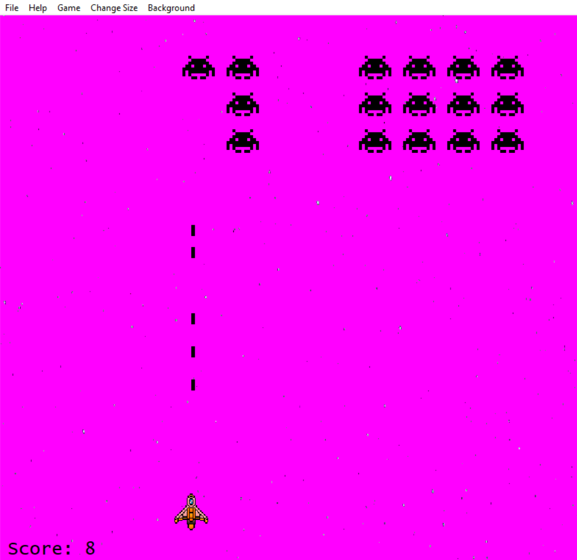

# Space Invaders Clone Game

## Overview

A clone of the classic **Space Invaders** game built using **WinAPI** and **GDI**. It features player and enemy movement, shooting, background customization, and sprite animations. The game also includes a menu for game settings and saves user configurations.

## Screenshot

  

## Key Features

### Gameplay:
- **Player**: Red rectangular window (50x50 px), moves with arrow keys, shoots with spacebar.
- **Enemy**: Blue rectangular window (50x40 px), moves left and right via a timer.
- **Projectiles**: Small black windows (5x15 px) that move upward and disappear upon reaching the top.

### Window Behavior:
- Fixed size (800x600 px), cannot resize but can move and minimize.
- Centered on screen, always on top, and transparent when inactive (40% opacity).

### Background Customization:
- Choose between a **solid color** or **image file** as background.
- Background modes: **Centered**, **Stretched (Fill)**, **Tiled**, **Fitted**.

### Sprite Animation:
- Animated player and enemy objects using **GDI**.

### Menu and Configuration:
- Start a **new game** (F2), change **game size** (Ctrl+1, Ctrl+2, Ctrl+3).
- Select **background color** or **image** and apply various modes.
- Display current configuration with checkboxes.

### Scoring and Saving:
- Score is tracked and displayed.
- **Game settings** and **high scores** are saved in **INI files**.

### Collision Detection:
- Uses **IntersectRect** for projectile-enemy collision detection.

## Technologies Used:
- **WinAPI**: Window handling and user input.
- **GDI**: Rendering player, enemy, and background.
- **Timers**: Enemy movement and projectile speed.
- **INI Files**: Saving/loading game settings and scores.

## How to Play:
1. **Start Game**: Press `F2`.
2. **Move Player**: Use arrow keys.
3. **Shoot**: Press spacebar to shoot projectiles.
4. **Game Over**: End when player or enemies are defeated.
5. **Adjust Settings**: Use the menu for size, background, and configuration.

## License
MIT License. This project is for educational purposes.